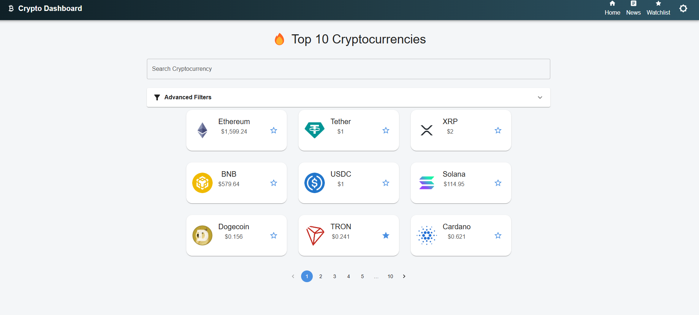
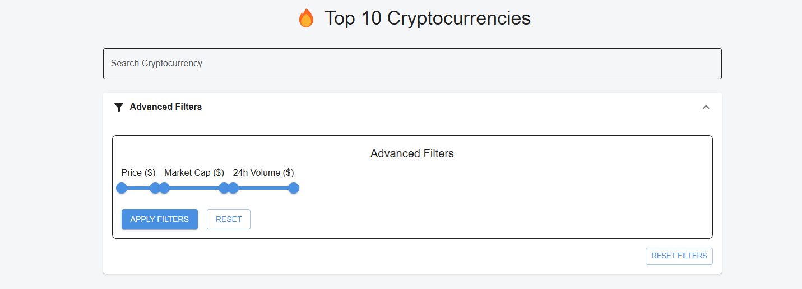
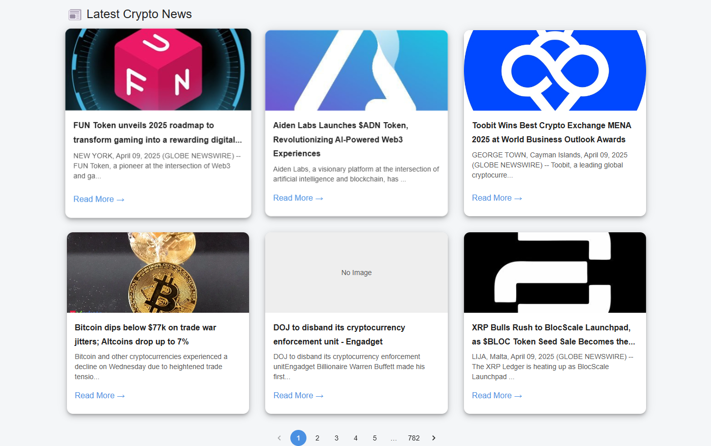
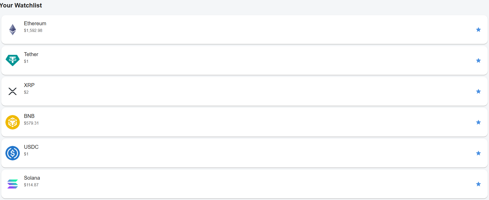

# 💹 CryptoVerse Dashboard

CryptoVerse is a modern, responsive, and dynamic cryptocurrency dashboard built with **React + Vite**. It provides users with real-time data, market insights, news, and visualization tools to track cryptocurrency trends efficiently.

---

## 🚀 Features

### ✅ Core Implementations

- **Live Crypto Data:** Real-time coin statistics fetched via public crypto APIs.
- **Coin Search & Filters:** Advanced search with filters on market cap, volume, and price.
- **Dark/Light Mode:** Smooth toggling between visually appealing dark and light themes.
- **Coin Detail View:** Drill-down view with historical charts and in-depth data.
- **News Section:** Stay up-to-date with the latest crypto news articles.
- **Watchlist:** Persistent favorite coins stored using `localStorage`.
- **Responsive UI:** Optimized for desktops, tablets, and mobile devices.
- **Skeleton Loaders:** Intuitive loading indicators using Material UI Skeleton.
- **Drawer Navigation:** Responsive side drawer for seamless navigation.

---

## 📅 Project Structure

```
src/
├── assets/             # Images and static files
├── components/         # Reusable UI components
├── config/             # API constants and base configuration
├── pages/              # App routes like Home, CoinDetail, News
├── utils/              # Helper functions and formatting logic
├── App.jsx             # Main app layout
└── main.jsx            # Entry point with service worker registration
```

---

## 💡 Tech Stack

| Technology         | Purpose                                      |
|-------------------|----------------------------------------------|
| React + Vite      | High-performance frontend setup              |
| Material UI       | Component library for design & layout        |
| Axios             | API data fetching                            |
| React Chart.js 2  | Charting library for data visualization      |
| React Router DOM  | SPA routing and navigation                   |

---

## 🧱 Installation & Setup

```bash
# 1. Clone the repository
git clone https://github.com/your-username/crypto-dashboard.git

# 2. Navigate to the project directory
cd crypto-dashboard

# 3. Install dependencies
npm install

# 4. Start development server
npm run dev
```

---

## 🛠️ Scripts

```bash
npm run dev         # Launches local development server
npm run build       # Builds for production
npm run preview     # Previews production build locally
```

---

## 💧 Optimizations & Best Practices

- ✅ **Code Splitting** via route-level lazy loading
- ✅ **Skeleton Loaders** for better perceived performance
- ✅ **Modular Components** and clean folder structure
- ✅ **Responsive Design** using Material UI breakpoints
- ✅ **Theming Support** using MUI's dark/light mode
- ✅ **Local Storage** to persist watchlist data
- ✅ **Reusable Axios Instances** for API abstraction

---

## ⚡ Enhancements To Be Done

- [ ] **Progressive Web App (PWA) Support** (Service worker, manifest)
- [ ] **Accessibility Improvements** (ARIA roles, keyboard navigation)
- [ ] **SEO Optimization** (Meta tags, Open Graph, dynamic titles)
- [ ] **Testing Suite** (Unit tests and integration tests)
- [ ] **Code Quality Tools** (ESLint, Prettier configuration)

---

## 📃 Packages Used

```json
"dependencies": {
  "@emotion/react": "^11.x",
  "@emotion/styled": "^11.x",
  "@mui/icons-material": "^5.x",
  "@mui/material": "^5.x",
  "axios": "^1.x",
  "chart.js": "^4.x",
  "react-chartjs-2": "^5.x",
  "react-router-dom": "^6.x",
  "react": "^18.x",
  "react-dom": "^18.x"
}
```

---

## 📸 Screenshots (Optional)




> Add preview images of the home page, coin details, filters, news, and theme toggle here.

---

## 💚 Contributing

Feel free to fork this repository, create a branch, and open a pull request for any bug fixes, enhancements, or new features.

---

## 👋 Acknowledgments

- CoinGecko / CoinPaprika APIs for crypto data
- Material UI for design system
- Chart.js for historical chart rendering
- News API for market-related news

---

## 📄 License

This project is licensed under the [MIT License](LICENSE).

---

Built with ❤️ by prabhanjan

